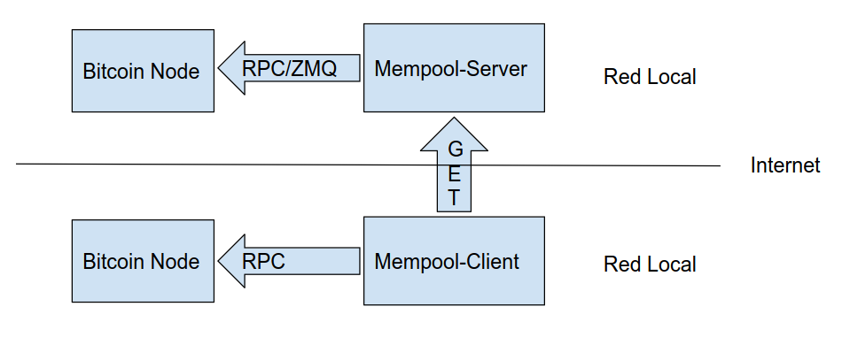

Mempool-server
==============

Mempool-server is a service which keeps track of a Bitcoin node mempool and serves its contents via http GET. Then [bitcoin-client](https://github.com/dev7ba/mempool-client) can ask for that mempool and inject it in another Bitcoin node.

The main purpose of mempool-server/client is to be able to fill a just-started Bitcoin node with transactions from another mempool, avoiding the time necessary for a node to 'sync with the mempool'. Be aware that there is not such a thing as a global Mempool, so differences between nodes are expected.



How does it works?
------------------

When initializing, the server first starts a zmq listener to listen incoming txs/blocks, then loads the mempool via  `getrawmempool(verbose)` and  `getrawtransaction` and orders the transactions by its dependency depth. Those ordered txs are inserted in a concurrent `SkipMap` which keeps that order, and allows concurrent reads for the http server part. Finally, txs/blocks events incoming from zmq interface are stored by incoming order in the `SkipMap` using an increasing mempool counter. A `DashMap` is used to keep the relation between a txId and its position in the `SkipMap` to be able to delete txs when needed.

When a client asks for the mempool, it will receive all the transactions stored at the moment ordered by dependency/depth (when loading) and arrival order (via zmq interface). This order guarantees that no txs are injected into a bitcoin node using bitcoin-client before any of its parents, thus, resulting in an error.

This server thas two endpoints: `/mempool/txsdata` and `/mempool/txsdatafrom/{mempool_counter}`. First endpoint downloads the whole mempool up to the current moment of the query. To signal that moment, the last mempool counter is returned along with all mempool data. The second endpoint works the same, but it returns all mempool data from a mempool counter. Calling repeatedly to the second function until the mempool counter received is equal to the asked for guarantees that server and client mempool are syncronized at that point (almost, due to tx collision between already-in-node transactions).

Binary schema for `/mempool/txsdata`:

|u64:MAX|mempool_hint_size:u32|mempool_counter:u64| [|txsize:u32|txdata:Vec<u8>|...]*mempool_hint_size

Binary schema for `/mempool/txsdatafrom/{mempool_counter}`:

|u64:MAX|mempool_counter:u64| [|txsize:u32|txdata:Vec<u8>|...]* N times

Note that `/mempool/txsdatafrom/{mempool_counter}` cannot return a hint of the number of txs returned.

Mempool-server uses asyncronous streams in http GETs to avoid using too much memory.

Mempool-server connects to Bitcoin RPC using user and password (deprecated), or using cookie authentication.

Mempool-server is compatible with any limitancestorcount value in bitcoin.conf

Usage
-----

If not using the defaults shown at execution, you must have a `config.toml` file in the same directory as your executable with contents like the following:
```
[bitcoindclient]
  # Use cookie authentication
  cookieauthpath = "/home/my_linux_user/.bitcoin/.cookie"
  # If you use user/password authentication uncomment these lines
  # user = "anon"
  # passwd = "anon"

  # Bitcoin node ipaddr for rpc interface
  ipaddr = "my_node_rpc_ip_address"
  # Bitcoin node zmq interface defined in bitcoin.conf
  zmqurl = "tcp://my_node_zmq_ip_address:port"
  # Time waiting for any txs from bitcoind, ends server if timeout.
  # Use restart: always in a docker container to have tolerance to failure.
  # Defaults to 60 seconds
  waittimeoutsec = 60 
```
Do not forget to add ``zmqpubrawtx=tcp://my_pub_ip:my_pub_port`` in source node `bitcoin.conf` file. 

Compilling instructions
-----------------------

- Install [rust](https://rustup.rs/) in your system
- Clone the repository in a directory: `git clone https://github.com/dev7ba/mempool-server.git`
- Clone [bitcoincore_zmq](https://github.com/dev7ba/bitcoincore-zmq) library repository the same directory as before: `git clone https://github.com/dev7ba/bitcoincore_zmq.git`
- Go into mempool-server directory and execute `cargo build` or `cargo build --release`. The executable will appear in `/mempool-server/target/debug` or in `/mempool-server/target/release`
- Enjoy
```
